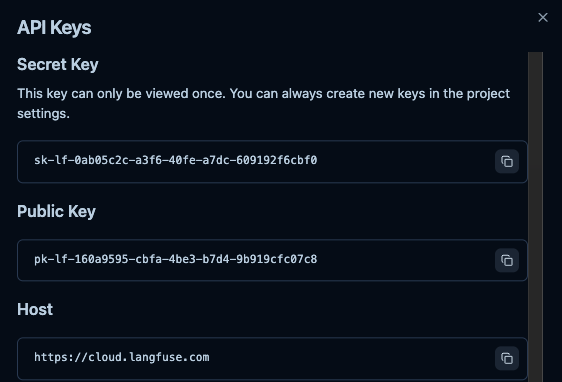

## 🌐 啟用 Langflow 與 Langfuse 監控

### 1️⃣ 註冊 Langfuse 帳號

* 前往：[https://cloud.langfuse.com/auth/sign-up](https://cloud.langfuse.com/auth/sign-up)
* 建議選擇區域：**eu**

註冊後請在 **API Keys** 頁面生成憑證，並記下以下資訊（將填入 `.env.example`）：

* `LANGFUSE_SECRET_KEY`
* `LANGFUSE_PUBLIC_KEY`
* `LANGFUSE_HOST`

以下為範例畫面：



---

### 2️⃣ 設定環境變數

1. 開啟 `.env.example`，將上述三項憑證填入對應欄位
2. 儲存後，將檔案重新命名為：

   ```bash
   mv .env.example .env.local
   ```
---

### 3️⃣ 給啟動腳本執行權限

若需啟動腳本（如 `run_langflow.sh`），請先給予執行權限：

```bash
chmod +x run_langflow.sh
```

> 💡 **Windows 用戶：**
> 可使用 Git Bash 執行 `chmod`，或直接略過，改用以下方式執行腳本：
>
> ```bash
> bash run_langflow.sh
> ```

---

### 4️⃣ 啟動 Langflow + Langfuse

```bash
./run_langflow.sh
```

啟動成功後，終端機會顯示類似：

```
http://127.0.0.1:7860
```

在瀏覽器開啟上述網址，即可進入 Langflow 編輯介面。

最後至 Langfuse Cloud 檢視呼叫紀錄：

```
https://cloud.langfuse.com
```

資料庫後台連結：

```
https://supabase.com/dashboard/project/rwspgisshxykqljwibko/database/tables
```
---

## 💡 補充說明

* 建議依照本指南使用 CLI 版本，桌面版 Langflow 可能與此流程略有不同
* 若安裝過程中出現問題，可參考官方教學：

  * [Langflow 安裝教學](https://docs.langflow.org/get-started-installation)
  * [Langfuse 完整教學](https://langfuse.com/docs/get-started)

